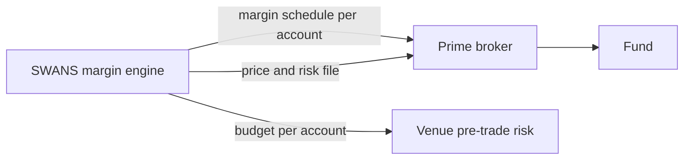

# Margin and collateral

## Principles

SWANS positions are margined futures-style: nothing is paid at trade time; gains and losses are settled daily (and intraday when called) as variation margin; the position carries initial margin against close-out risk. Collateral is held by your prime broker in segregated accounts, never by SWANS.

The SWANS margin methodology (Margin Framework v6) computes one number per account. SWANS acts as calculation agent under the CSA between member and PB.

| Layer | Who binds it | Where it applies |
|---|---|---|
| PB margin | Your PB, using the SWANS margin schedule as calculation agent | What you post to your PB under the CSA |
| SWANS margin budget | Your PB sets `max_swans_im` per account | Pre-trade: orders that would exceed it are rejected |
| PB netting | Your PB's portfolio-margin policy | Whether the position offsets your other holdings |



## Methodology

**Three layers, kept separate.** Structural maximum loss (horizon-free, exact over admissible family states); terminal outcome VaR/ES (horizon-free diagnostic); and the production margin: close-out loss over a margin period of risk (MPOR).

**Structural maximum loss.** For account *i* with signed positions *Q* and filtered fair marks *X*, remaining gross loss is `max over admissible states y of [V_i − Π_i(y)]⁺`, computed family by family. A standalone long at *X* has max loss `Q·X`; a short has `|Q|·(1−X)`. Mutually exclusive and nested families are evaluated over their admissible states only, never as a blind sum. IM never exceeds this number.

**Fair marks.** Margin is keyed to a filtered fair mark, not the last print in a thin book. Hierarchy: crossed-volume auction price; executable microprice from two-sided depth; time-decayed VWAP of recent trades; model-assisted mark; governed fallback. Combined in logit space with weights for depth, spread, recency and staleness; filtered; projected onto the family constraints (buckets sum to one; ladders monotone). The same mark drives variation margin, margin and the daily price file.

**MPOR close-out engine.** Monte Carlo over `[t, t + h_i]`, where `h_i = h₀(class) + liquidity + concentration + operational + oracle add-ons`, evaluated as the maximum across the account's material buckets. Scenarios include bounded diffusion of unresolved probabilities, marked jump-to-resolution, common latent-factor moves, correlated resolution clusters, event-window hazard shifts, close-out slippage, settlement-delay shocks, and VM-collection timing. Core:

```
IM_core = max( VaR_99%(MPOR), κ·ES_97.5%(MPOR), IM_jump, IM_floor )
IM      = min( L_gross, IM_core + A_liq + A_conc + A_oracle + A_model + A_event + A_APC )
```

**Jump-to-resolution (sign-sensitive).** Long YES is hurt by a NO resolution (loss `Q·X`); short YES by a YES resolution (loss `|Q|·(1−X)`). Resolution intensities `Λ¹, Λ⁰` start as policy hazards by category and calendar state and move to calibrated survival models as data accrues.

**Add-ons.** Liquidity: phase 1 is policy-based (position beyond conservatively executable depth is charged a stressed haircut); phase 2 calibrates to realised close-out cost. Concentration: `ζ · L_side · ((c − c̄)⁺ / c̄)²`, convex above a share-of-open-interest threshold. Model risk: a buffer scaled to IM_core or to family gross loss for new families. Anti-procyclicality: pre-funds part of the gap between stressed and current margin. Oracle: settlement-delay and dispute risk.

**Event-window ramp.** As expected resolution approaches (calendar ramp from 20 to 10 business days) or resolution hazard rises (hazard ramp), IM converges smoothly to remaining gross maximum loss: `IM_event = (1−λ)·IM_hybrid + λ·L_gross`. No collateral cliff.

**Market-maker relief.** Shorter base MPOR or lower liquidity add-on only for designated liquidity providers meeting objective criteria (quote uptime, spread, depth, inventory reporting, VM capability, pre-funded buffer, default drills, no surveillance breaches); withdrawn automatically when criteria fail, one-sided flow dominates, the event ramp activates, concentration thresholds are breached, or VM is late.

**Stress-resource control.** Each account's stress loss beyond its margin is compared to its PB's limit; above thresholds the venue restricts risk-increasing orders, then requires full collateral on new trades.

**Cross-contract netting, staged.** (1) exact family netting over admissible states; (2) rule-based linked-contract offsets with an explicit finite state space; (3) same-sector or common-driver offsets with haircuts after validation; (4) broader portfolio margining after live data, backtesting and independent validation. Offsets need a conceptual hedge basis, not correlation alone.

## Launch posture

Phase 0: full collateral with the MPOR engine in shadow mode, collecting live data. Phase 1: hybrid margin for approved institutions on liquid contract classes. Phase 2: market-maker conditional relief. Phase 3: broader offsets. This is the offset roadmap with objective triggers for each phase.

## Worked example

Market maker long 1,000,000 contracts at 0.40, £100 payout, event four weeks away, liquid book. Structural maximum loss: 0.40 × 100 × 1,000,000 = £40m. MPOR margin over a two-day horizon with diffusion, jump and liquidity add-ons: materially below £40m while the event is distant and the book deep. Ten business days out, the calendar ramp has taken IM to £40m. If liquidity thins or the account's share of open interest crosses the concentration threshold, add-ons rise and market-maker relief is withdrawn.

## Variation margin and calls

`VM(t_{n−1}, t_n) = V_i(t_n) − V_i(t_{n−1})` on filtered fair marks. Required resources at each margin run: `IM + VM_due + buffer`; call = requirement minus account equity; withdrawable = equity − IM − buffer. Runs are daily at 17:00 London and intraday on trigger (mark move, event ramp, concentration). Calls carry a deadline; unpaid calls block risk-increasing orders, then trigger the PB's default procedures under the CSA. Your PB operationalises the call; SWANS supplies the numbers.

## Margin simulator

Members can estimate margin before trading: `POST /v1/accounts/{account}/margin/simulate` with a hypothetical portfolio returns IM, add-on attribution, event-ramp state and the fast bound used pre-trade.

## Files published by SWANS

| File | Recipient | Frequency |
|---|---|---|
| Margin schedule per account with attribution | Prime brokers | Daily, intraday on trigger |
| Clearing-member margin schedule per account, with add-on attribution | Clearing members | Daily, intraday on trigger |
| Price and risk file (filtered marks, IM, sensitivities) | Prime brokers, members | Daily |
| Backtest, sensitivity and trigger report | Prime brokers, FCA | Monthly |
