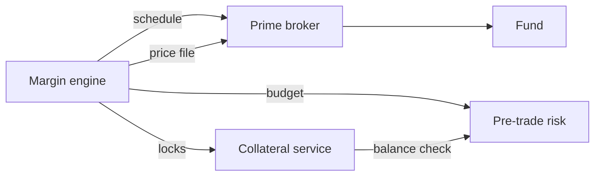

# Margin and collateral

## Collateral modes

SWANS supports two modes per account:

| Mode | How margin works | Who holds cash |
|---|---|---|
| **PB-managed** | Futures-style margining. Nothing paid at trade time; VM settled at each window; IM from the margin engine. SWANS is calculation agent under the CSA. | Prime broker |
| **Full collateral** | Max loss locked at trade time. VM transfers at each window. No margin engine dependency for pre-trade. | SWANS (via custodian) |



## Methodology overview

**Two engines.** The MPOR engine (close-out loss simulation) is authoritative for clearing IM. A terminal engine runs as a standing challenger. Cross-engine divergence is meaningful only under aligned comparison — a 5-day close-out loss and a to-resolution terminal loss are different by design.

**Three layers, kept separate.** Structural maximum loss (exact over admissible family states); terminal VaR/ES (diagnostic); and production margin: close-out loss over a margin period of risk (MPOR).

**IM formula.**

```
IM_core  = max( VaR_99%, ES_97.5%, IM_jump, IM_floor )
IM       = min( L_gross, IM_core + add-ons )
IM_event = (1 - lambda) * IM + lambda * L_gross
```

Add-ons: liquidity, concentration, oracle, model risk, event ramp, anti-procyclicality. Event ramp smoothly converges IM to max loss as resolution approaches — no collateral cliff.

**Fair marks.** Margin is keyed to a filtered fair mark, not the last print. Hierarchy: auction price, executable microprice, decayed VWAP, model mark. Combined in logit space with weights for depth, spread, recency and staleness.

**Market-maker relief.** Shorter MPOR or lower liquidity add-on for designated LPs meeting objective criteria (quote uptime, spread, depth). Withdrawn automatically on breach.

**Gross customer margin.** Customer-origin IM is gross: sum of individual-customer IM with no inter-customer netting.

## Netting layers

| Layer | Mechanism |
|---|---|
| 1. Same-contract | Aggregate trades into net position per margin unit |
| 2. Structural family | Evaluate over admissible terminal states (exact payoff logic) |
| 3. Spread/portfolio margining | Jointly simulate related positions in approved groups; requires conceptual basis and evidence |

Inter-DCO cross-margining is a separate architecture.

## Launch posture

Phase 0: full collateral with the MPOR engine in shadow mode. Phase 1: hybrid margin for approved institutions. Phase 2: market-maker relief. Phase 3: broader offsets.

## Variation margin

At each VM window (00:00, 08:00, 16:00 UTC): `VM = V(t_1) - V(t_0)` on filtered fair marks. Call = requirement minus equity; withdrawable = equity minus requirement.

**PB-managed:** PB operationalises the call under the CSA. **Full-collateral:** the collateral service executes VM transfers automatically.

## Margin call lifecycle

DRAFT, ISSUED, ACKNOWLEDGED, PARTIALLY_SATISFIED, SATISFIED — with DISPUTED, FAILED and DEFAULT_ESCALATION branches. Each transition records actor, timestamp, reason and evidence.

## Margin simulator

`POST /v1/accounts/{account}/margin/simulate` with a hypothetical portfolio returns IM, add-on attribution, event-ramp state and fast bound.

## Files published

| File | Recipient | Frequency |
|---|---|---|
| Margin schedule with attribution | Prime brokers | VM window, intraday on trigger |
| Price and risk file | Prime brokers, members | VM window |
| Backtest and sensitivity report | Prime brokers, FCA | Monthly |
