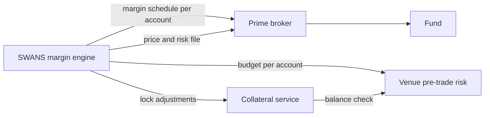

# Margin and collateral

## Principles

SWANS supports two collateral modes per account:

| Mode | How margin works | Who holds cash |
|---|---|---|
| **PB-managed** | Futures-style margining. Nothing paid at trade time; VM settled at each window; IM from the margin engine. SWANS is calculation agent under the CSA. | Prime broker |
| **Full collateral** | Max loss locked at trade time. VM transfers at each window. No margin engine dependency for pre-trade. | SWANS (via custodian) |

The SWANS margin methodology (Margin Framework v6) computes one number per account. The methodology is the same regardless of mode — the difference is who enforces it.

| Layer | Who binds it | Where it applies |
|---|---|---|
| PB margin | Your PB, using the SWANS margin schedule as calculation agent | What you post to your PB under the CSA |
| SWANS margin budget | Your PB sets `max_swans_im` per account | Pre-trade: orders that would exceed it are rejected |
| Full-collateral lock | SWANS collateral service | Pre-trade: available balance must cover max loss |
| PB netting | Your PB's portfolio-margin policy | Whether the position offsets your other holdings |



## Methodology

**Two-engine architecture.** The risk engine runs two engines on every official risk run. The MPOR engine (close-out loss simulation) is authoritative for clearing IM. A terminal factor/copula engine runs as a standing challenger for diagnostics, structural validation and stress. Cross-engine divergence is meaningful only when the two outputs are deliberately aligned on horizon, measure and output definition; a difference between a 5-day close-out loss and a to-resolution terminal loss is expected, not a defect.

**Three layers, kept separate.** Structural maximum loss (horizon-free, exact over admissible family states); terminal outcome VaR/ES (horizon-free diagnostic); and the production margin: close-out loss over a margin period of risk (MPOR).

**Structural maximum loss.** For account *a* with signed positions *Q* and filtered fair marks *X*, remaining gross loss is `max over admissible states y of [V_a − Π_a(y)]⁺`, computed family by family. A standalone long at *X* has max loss `Q·X`; a short has `|Q|·(1−X)`. Mutually exclusive and nested families are evaluated over their admissible states only, never as a blind sum. IM never exceeds this number.

**Fair marks.** Margin is keyed to a filtered fair mark, not the last print in a thin book. Hierarchy: crossed-volume auction price; executable microprice from two-sided depth; time-decayed VWAP of recent trades; model-assisted mark; governed fallback. Combined in logit space with weights for depth, spread, recency and staleness; filtered; projected onto the family constraints (buckets sum to one; ladders monotone). The same mark drives variation margin, margin and the price file.

**MPOR close-out engine.** Monte Carlo over `[t, t + h_a]`, where `h_a = h₀(class) + liquidity + concentration + operational + oracle add-ons`, evaluated as the maximum across the account's material buckets. Scenarios include bounded diffusion of unresolved probabilities, marked jump-to-resolution, common latent-factor moves, correlated resolution clusters, event-window hazard shifts, close-out slippage, settlement-delay shocks, and VM-collection timing. Core:

```
IM_core = max( VaR_99%(MPOR), κ·ES_97.5%(MPOR), IM_jump, IM_floor )
IM      = min( L_gross, IM_core + A_liq + A_conc + A_oracle + A_model + A_event + A_APC )
```

**Event-window ramp.** As expected resolution approaches (calendar ramp from 20 to 10 business days) or resolution hazard rises (hazard ramp), IM converges smoothly to remaining gross maximum loss: `IM_event = (1−λ)·IM_hybrid + λ·L_gross`. No collateral cliff.

**Jump-to-resolution (sign-sensitive).** Long YES is hurt by a NO resolution (loss `Q·X`); short YES by a YES resolution (loss `|Q|·(1−X)`). Resolution intensities `Λ¹, Λ⁰` start as policy hazards by category and calendar state and move to calibrated survival models as data accrues.

**Add-ons.** Liquidity: phase 1 is policy-based (position beyond conservatively executable depth is charged a stressed haircut); phase 2 calibrates to realised close-out cost. Concentration: `ζ · L_side · ((c − c̄)⁺ / c̄)²`, convex above a share-of-open-interest threshold. Model risk: a buffer scaled to IM_core or to family gross loss for new families, including aligned two-engine divergence above threshold. Anti-procyclicality: pre-funds part of the gap between stressed and current margin. Oracle: settlement-delay and dispute risk.

**Market-maker relief.** Shorter base MPOR or lower liquidity add-on only for designated liquidity providers meeting objective criteria (quote uptime, spread, depth, inventory reporting, VM capability, pre-funded buffer, default drills, no surveillance breaches); withdrawn automatically when criteria fail, one-sided flow dominates, the event ramp activates, concentration thresholds are breached, or VM is late.

**Gross customer margin.** Customer-origin IM is calculated as the gross sum of individual-customer IM requirements, with no inter-customer netting. House accounts may be margined net where permitted.

**Cross-contract netting, staged.** Three layers, correctly named per CFTC terminology:

1. **Same-contract netting:** aggregate trades into `Q_ak` within one legal margin unit (deterministic bookkeeping). For customer-origin calculations, aggregation is per individual customer before gross summation.
2. **Structural family netting:** mutually exclusive, nested and linked contracts evaluated over admissible terminal states (exact payoff logic).
3. **Spread/portfolio margining (§39.13(g)(4)):** jointly simulate related positions in approved groups; diversification in the portfolio loss distribution. Conceptual basis may include complement/substitute relationships, shared inputs or common external drivers — not limited to a named global factor.

Inter-DCO cross-margining (§39.13(i)) is a separate architecture and regulatory workstream, not the in-house mechanism.

## Launch posture

Phase 0: full collateral with the MPOR engine in shadow mode, collecting live data. Phase 1: hybrid margin for approved institutions on liquid contract classes. Phase 2: market-maker conditional relief. Phase 3: broader offsets. This is the offset roadmap with objective triggers for each phase.

## Worked example

Market maker long 1,000,000 contracts at 0.40, £100 payout, event four weeks away, liquid book. Structural maximum loss: 0.40 × 100 × 1,000,000 = £40m. MPOR margin over a two-day horizon with diffusion, jump and liquidity add-ons: materially below £40m while the event is distant and the book deep. Ten business days out, the calendar ramp has taken IM to £40m. If liquidity thins or the account's share of open interest crosses the concentration threshold, add-ons rise and market-maker relief is withdrawn.

## Variation margin and calls

At each VM window (00:00, 08:00, 16:00 UTC): `VM = V_a(t_n) − V_a(t_{n−1})` on filtered fair marks. Required resources at each margin run: `IM + VM_due + buffer`; call = requirement minus account equity; withdrawable = equity − IM − buffer.

**PB-managed accounts:** PB operationalises the call under the CSA. SWANS supplies the numbers.

**Full-collateral accounts:** the collateral service executes VM transfers automatically, adjusts locks, and blocks risk-increasing orders if the balance cannot cover the adjusted lock.

## Margin call lifecycle

Margin calls follow a formal lifecycle: DRAFT → ISSUED → ACKNOWLEDGED → PARTIALLY_SATISFIED → SATISFIED, with DISPUTED, FAILED and DEFAULT_ESCALATION branches. Each transition is recorded with actor, timestamp, reason and evidence. See [Margin service](../internal/services/margin.md) for details.

## Margin simulator

Members can estimate margin before trading: `POST /v1/accounts/{account}/margin/simulate` with a hypothetical portfolio returns IM, add-on attribution, event-ramp state, two-engine comparison and the fast bound used pre-trade.

## Files published by SWANS

| File | Recipient | Frequency |
|---|---|---|
| Margin schedule per account with attribution | Prime brokers | VM window, intraday on trigger |
| Price and risk file (filtered marks, IM, sensitivities) | Prime brokers, members | VM window |
| Backtest, sensitivity and trigger report | Prime brokers, FCA | Monthly |
| Two-engine divergence report | Risk desk | Every official run |
