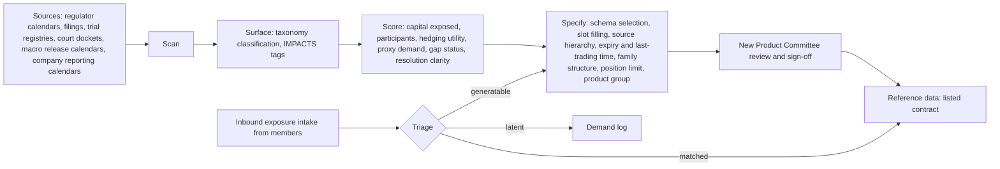

# Contract schemas and the contract engine

Every SWANS contract is an instance of one of ten schemas. A schema fixes the question template, which values each slot may take, the settlement source hierarchy, the resolution and void rules, the manipulation-resistance analysis and the position-limit policy. Members, prime brokers and the regulator evaluate the ten schemas once; instances are listed under them continuously.

## Schema register

| Code | Name | Question template | Settlement source | Family structure |
|---|---|---|---|---|
| S-01 | REGCERT-DECISION | Will *issuer* *action* *subject* by *date*? | The regulator's or court's own publication (FDA, EMA, CMS, FTC, courts, central banks) | Standalone; S-06 builds timing families on it |
| S-02 | REGCERT-DISCLOSURE | Will *company* disclose *fact* (e.g. trial meets primary endpoint) by *date*? | Company filing or press release on the regulatory record (EDGAR, RNS, trial registry) | Standalone |
| S-03 | KPITHRESH-PUBLISHED | Will *published series* be *comparator* *threshold* at *release*? | Statistics office or central bank release (BLS, ONS, ECB, BoE, Fed) | Threshold ladders: nested |
| S-04 | KPITHRESH-COMPANY | Will *company* report *KPI* *comparator* *threshold* for *period*? | Company's audited or regulatory-filed figure | Threshold ladders: nested |
| S-05 | BUCKETED-LEVEL | In which bucket will *level* fall at *release*? (one contract per bucket) | As S-03/S-04 | Mutually exclusive, exhaustive |
| S-06 | BUCKETED-TIMING | In which period will *event* occur? (one contract per period, plus "not by") | As S-01/S-02 | Mutually exclusive, exhaustive |
| S-07 | RELVAL-SEQUENCE | Does *event A* occur on or before *event B*, by *deadline*? | Each event's own primary source; tie-break pre-stated | Standalone |
| S-08 | RELVAL-LEVEL | Will *series A* stand *comparator* *series B* on *date*? | Each series' primary publication at the designated fixing | Standalone |
| S-09 | PERSISTENCE | Does *condition* hold for *quantifier* of observations during *period*? | Underlying condition's source at each observation | Standalone, path-dependent |
| S-10 | BASKET-COUNT | Do at least *N* of the *M* enumerated events occur by *date*? | Each component's source | Cluster product group; margined as a stress-tested group |

S-01 to S-08 are launch schemas. S-09 and S-10 are listed after the venue has an operating record, because their margin treatment depends on joint-distribution evidence.

**Measured contracts.** Where a schema's outcome is a published number (S-03, S-04, S-08), a contract may settle linearly between two pre-stated strikes instead of as a binary. Settlement value is `clamp((figure − K_low) / (K_high − K_low), 0, 1)`.

## Families and admissible states

Family structure is part of the contract's reference data and is used by pricing, margin and settlement:

| Family type | Admissible terminal states | Example |
|---|---|---|
| `standalone` | {0, 1} | S-01 FDA approval by date |
| `nested` | Monotone ladder: (0,0,0), (0,0,1), (0,1,1), (1,1,1) | S-03 NFP ≥ 100k / ≥ 200k / ≥ 300k |
| `mutually_exclusive` | Exactly one contract settles at 1 | S-05 FOMC target range buckets; S-06 certification quarter |
| `cluster` | Joint outcomes of M enumerated components | S-10 ≥ N of M antitrust rulings |

Fair marks are projected onto the family constraint set (ladder monotonicity, buckets summing to one), and margin for a family is computed over its admissible states, which is the exact worst case rather than a portfolio offset.

## Contract engine

The engine turns public events into listable contracts and reviews them before listing.

**Contract proposal record** (output of Specify): schema, question, outcomes, settlement source and hierarchy, resolution date or window, family structure, taxonomy class, relevance score, hedging rationale, gap status, proxy demand, proposed position limit, proposed product group, filing route.

**Listing checklist (New Product Committee):** identify schema; confirm slot eligibility; confirm Tier-1 source; run the prohibited-category screen; set position limit; assign product group and family; confirm expiry precedes the earliest publication window; risk sign-off where required; document and list.

**Objectivity test.** A candidate is listable only if the outcome is verifiable from a named source on a defined date. If it cannot be made objective, it is not a contract; the request is logged as latent demand.

**Resolution doctrine.** Contracts never settle on consensus, analyst estimates, media reports or the venue's own judgement of a fact. They settle on the named source's publication. If the source does not publish by the deadline, the schema's fallback rule applies.
