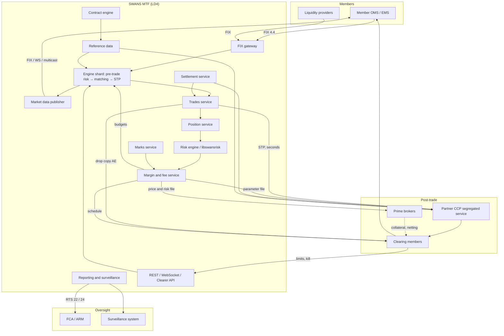
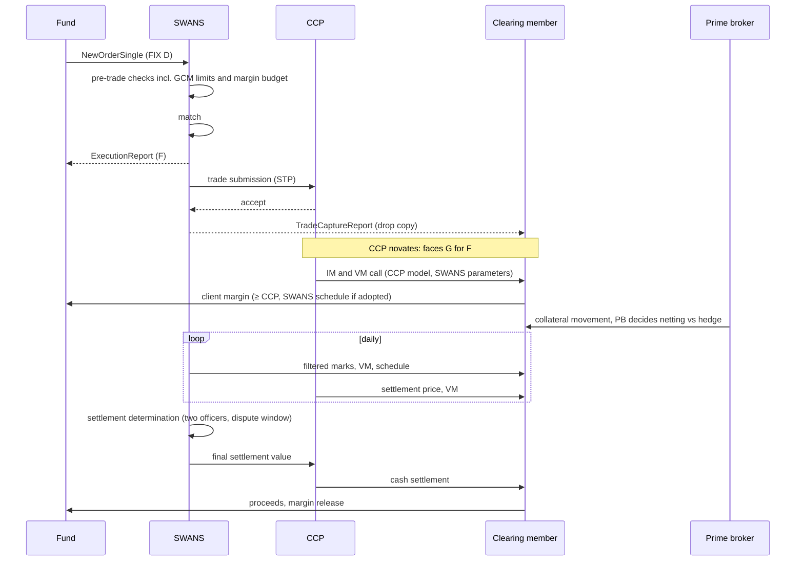
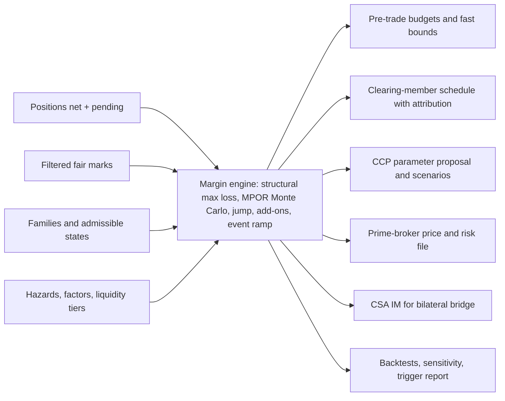
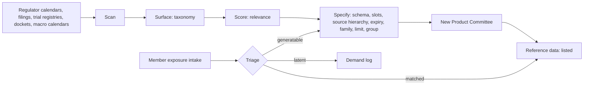
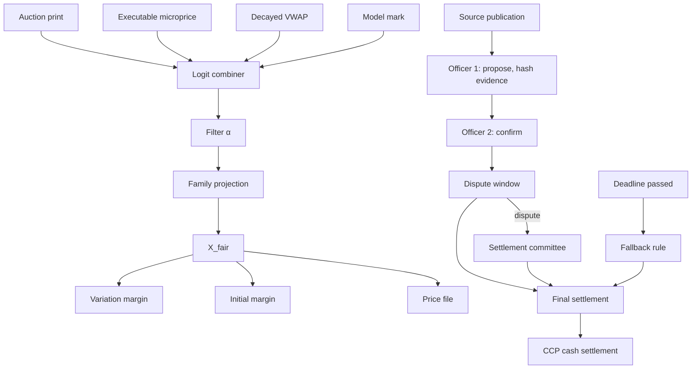
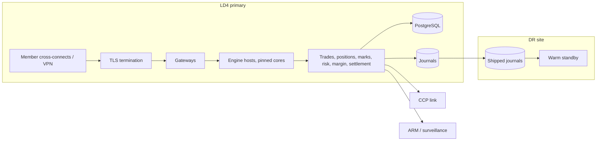
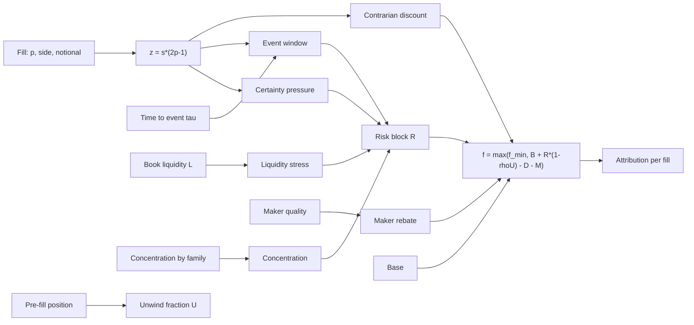

# End-to-end views

All diagrams are Mermaid; GitHub renders them natively and the MkDocs site renders them with the mermaid2 plugin.

## 1. Whole venue

## 2. Trade lifecycle

## 3. Margin engine outputs

## 4. Contract engine

## 5. Marks and settlement

## 6. Deployment

## 7. Fee engine

