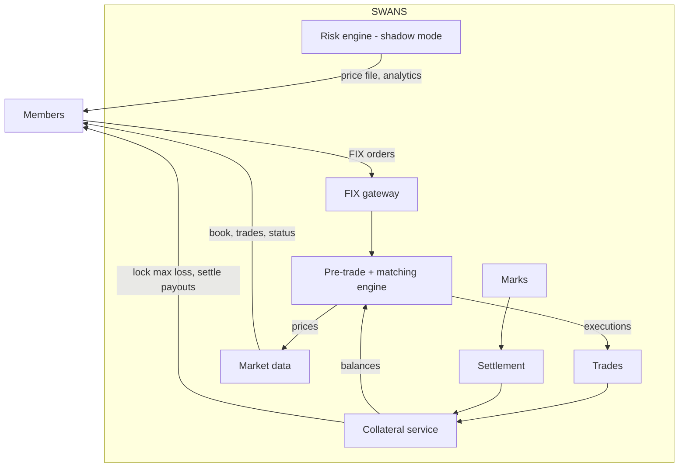
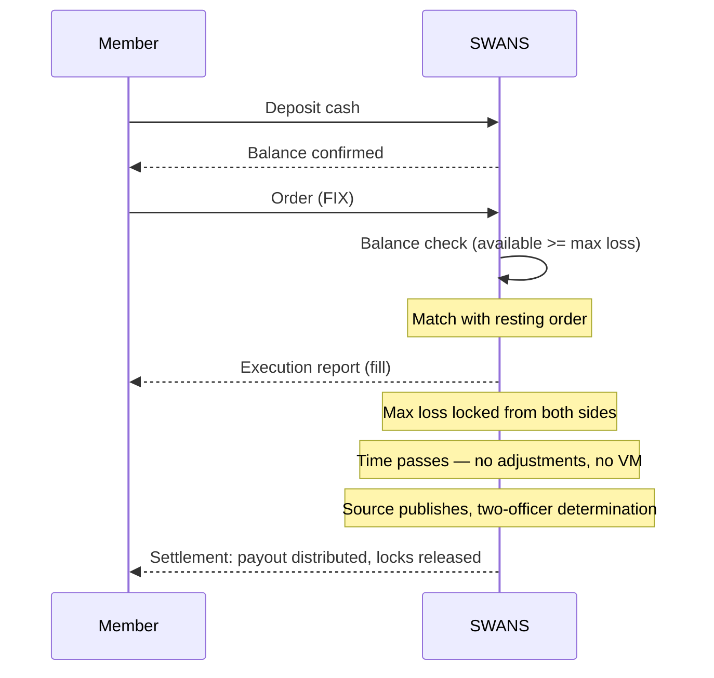
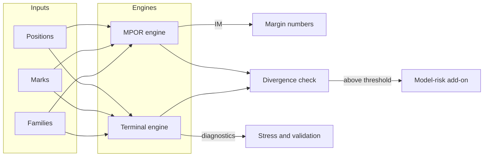
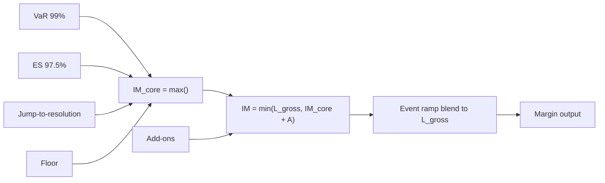
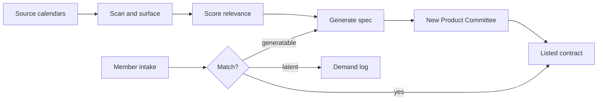
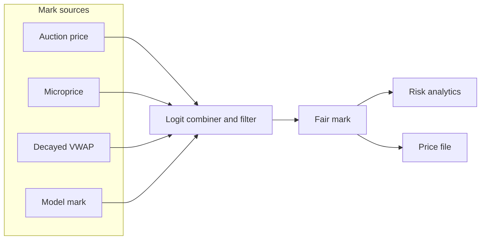
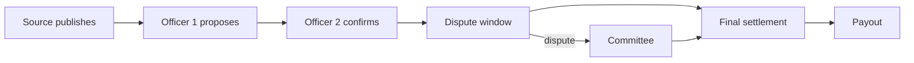
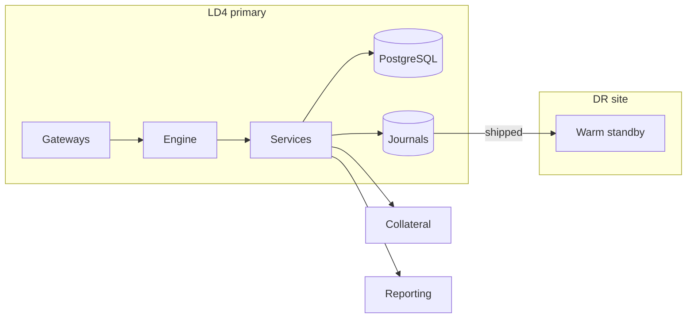

# Diagrams

## 1. Whole venue

## 2. Trade lifecycle (full collateral)

## 3. Two-engine risk architecture

The MPOR engine is authoritative for clearing IM. The terminal engine is a standing challenger. At launch, the risk engine runs in shadow mode (analytics only). It becomes production when margin is offered.

## 4. Margin formula

## 5. Contract engine

## 6. Marks and settlement

## 7. Deployment

