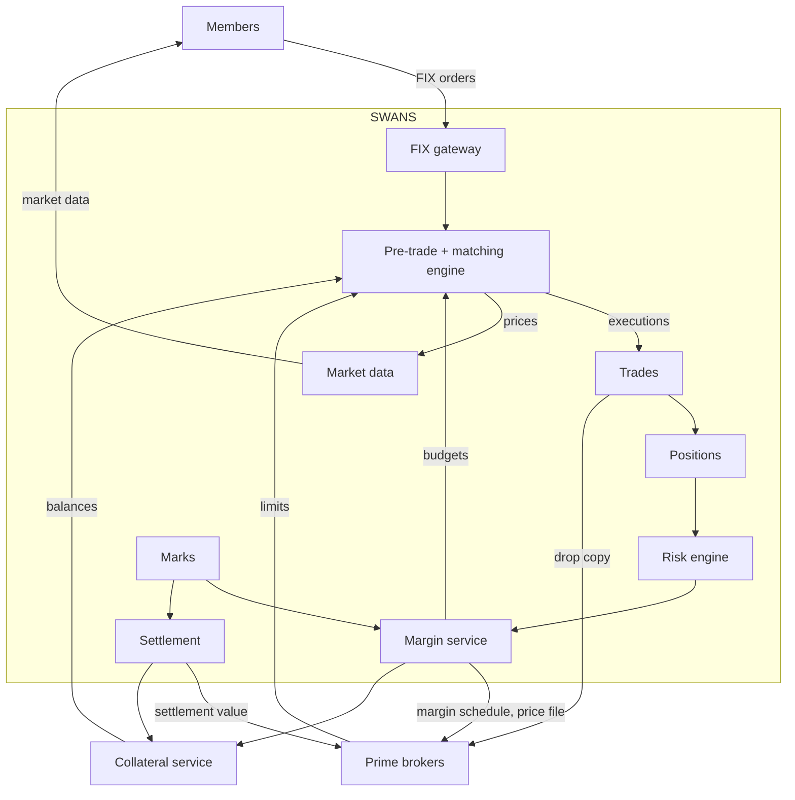
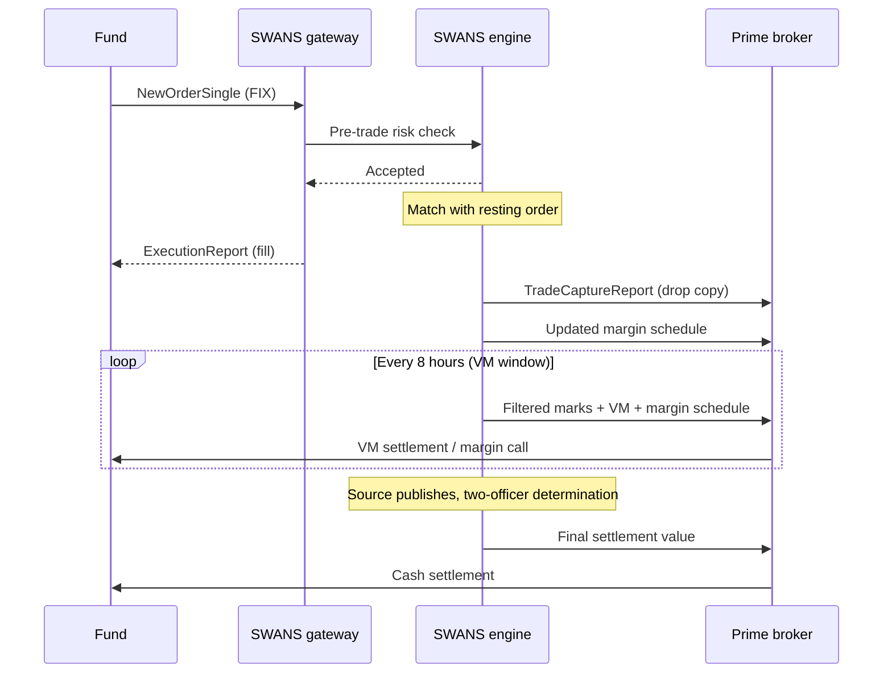
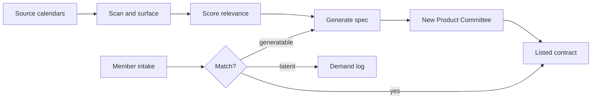
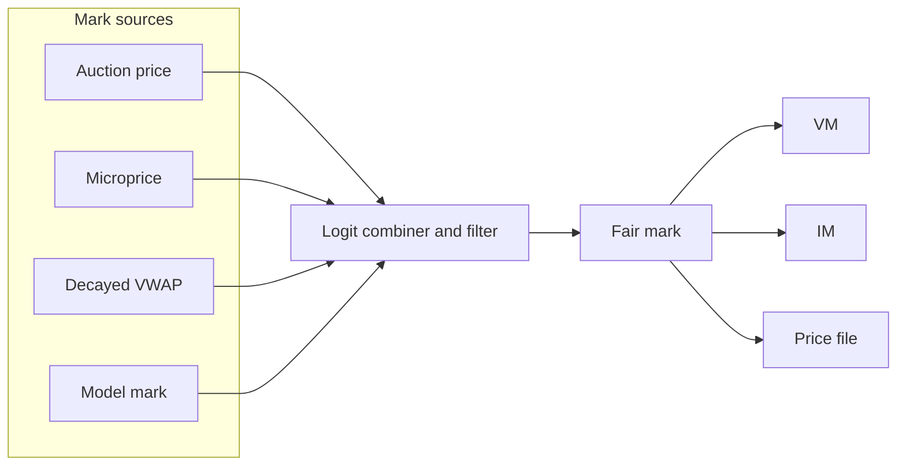
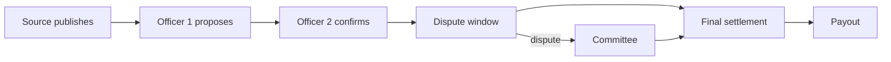
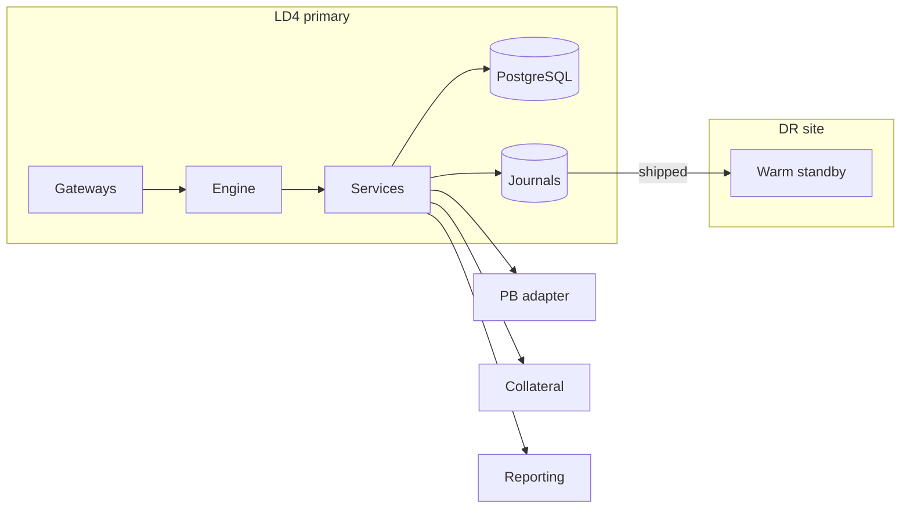

# End-to-end views

All diagrams are Mermaid; GitHub renders them natively and the MkDocs site renders them with the mermaid2 plugin.

## 1. Whole venue

## 2. Trade lifecycle

## 3. Two-engine risk architecture

The MPOR engine is authoritative for clearing IM. The terminal engine is a standing challenger. Both share the same factor state and calibration; divergence is diagnostic only under aligned comparison (the comparable-run rule).

## 4. Margin formula

## 5. Contract engine

## 6. Marks and settlement

## 7. Deployment

