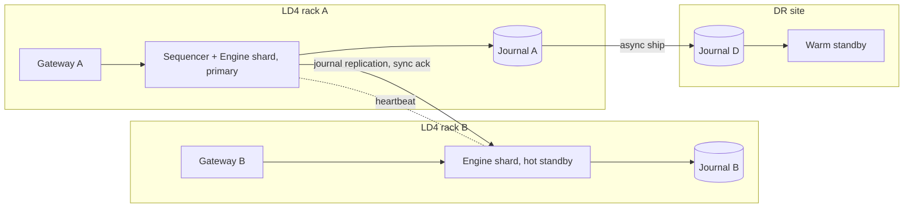

# High availability, failover and disaster recovery

**Assumption [confirm with Lyes]:** production must survive any single host, process, switch or link failure without losing an acknowledged order, and resume within the regulatory objective after site loss.

## Design

- **Sequencer.** One process per shard assigns `SeqNum` and writes the input journal. An input is acknowledged to the gateway only after the journal write is durable on the primary **and** replicated to the standby (synchronous, same-site). This is the durability boundary: no acknowledged input can be lost by a single failure.
- **Hot standby.** The standby replays the replicated journal continuously and holds identical book state. Failover: standby detects missed heartbeats (3 × 50 ms), fences the old primary (network ACL plus epoch number in every output), resumes from the last replicated `SeqNum`, and gateways reconnect. Target: order path resumed within 2 seconds; outputs after failover carry a new epoch so consumers can detect the switch.
- **Split brain.** Every output carries `(epoch, seq)`. Downstream services and gateways reject outputs from an older epoch. Epoch increments are recorded in the journal by the new primary.
- **Gateways.** Stateless beyond session state; members connect to two gateways (A and B, distinct IPs) and fail over at the FIX session layer with sequence-number recovery. Session state (sequence numbers, open orders by session) is replicated so `CancelOnDisconnect` behaves correctly on gateway failure.
- **Downstream services** (trades, positions, marks, margin, settlement) are restartable from journals and consume from the last acknowledged `SeqNum`; they tolerate replay.
- **Market data** publishes from the primary; on failover the standby republishes a snapshot with the new epoch.
- **Reference data and PostgreSQL** run with synchronous streaming replication within LD4 and async to DR.

## Disaster recovery

- Journals shipped asynchronously to the DR site; RPO ≤ 5 seconds of inputs, and any inputs not at DR are known by `SeqNum`, so members can be told exactly which orders were lost.
- DR activation: declared by the operations lead; FCA notified; members notified with the last accepted `SeqNum`; resting orders cancelled on activation; trading resumes in a continuous session after a 5-minute notice period, or with an opening auction if the rulebook requires one.
- RTO target: 2 hours from declaration **[confirm RTS 7]**; tested twice a year with members invited to the second test.

## Planned maintenance

Weekly window Saturday 08:00–12:00 London; announced 5 business days ahead; certification environment gets the release one week before production.
